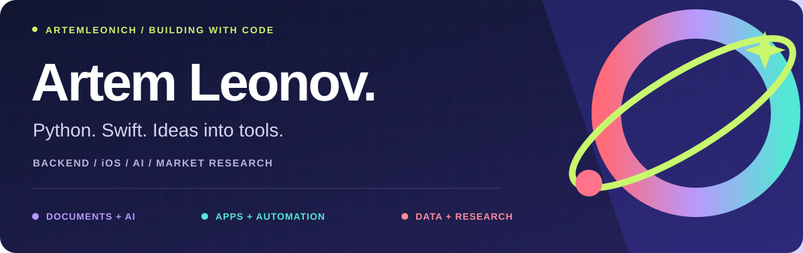
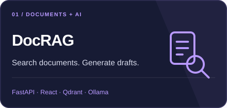
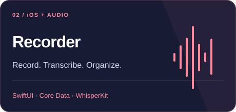
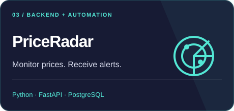
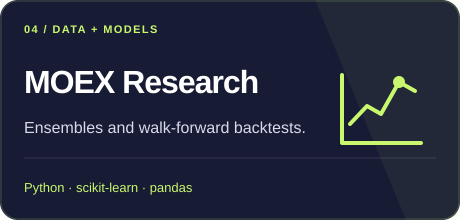
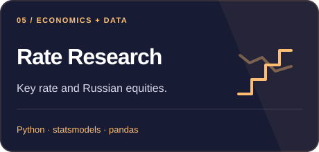

  

# Hi, I'm Artem 👋

I build **Python backends**, **iOS apps**, and tools that turn documents and data into something useful. My projects explore local AI, automation, and financial market research.

[Selected projects](#selected-projects) · [Toolbox](#toolbox) · [More to explore](#more-to-explore) · [По-русски](#по-русски)

## Selected projects

<table>
<tr>
<td width="50%" valign="top">

Local PDF assistant with hybrid retrieval, source citations, and Word / PowerPoint generation.

<a href="https://github.com/artemleonich/docrag">Explore DocRAG →</a>
</td>
<td width="50%" valign="top">

Voice notes with on-device WhisperKit transcription, audio import, search, and editing.

<a href="https://github.com/artemleonich/Recorder">Explore Recorder →</a>
</td>
</tr>
<tr>
<td width="50%" valign="top">

A price-monitoring MVP with marketplace parsers, background jobs, and Telegram notifications.

<a href="https://github.com/artemleonich/Parser-prices">Explore PriceRadar →</a>
</td>
<td width="50%" valign="top">

IslandForest ensembles, walk-forward evaluation, and portfolio backtests on MOEX data.

<a href="https://github.com/artemleonich/Moex">Explore MOEX Research →</a>
</td>
</tr>
<tr>
<td width="50%" valign="top">

Time-series research into the CBR key rate and Russian equities, with strategy experiments.

<a href="https://github.com/artemleonich/Moex-key-rate">Explore Rate Research →</a>
</td>
<td width="50%" valign="top">

A learning project in Django: posts, group feeds, comments, subscriptions, and tests.

<a href="https://github.com/artemleonich/yatube_project">Explore Yatube →</a>
</td>
</tr>
</table>

## Toolbox

| Area | Technologies used in my projects |
| :--- | :--- |
| Backend & automation | Python · FastAPI · Django · Celery · Telegram APIs |
| Documents & local AI | Qdrant · Ollama · BGE embeddings · WhisperKit |
| iOS | Swift · SwiftUI · UIKit · Core Data · AVFoundation |
| Data & research | pandas · NumPy · scikit-learn · statsmodels |
| Storage & development | PostgreSQL · Redis · SQLite · Docker · Git · pytest |

## More to explore

- **iOS practice:** [MovieQuiz](https://github.com/artemleonich/MovieQuiz-ios) and [Counter](https://github.com/artemleonich/Counter).
- **Automation:** [Homework Bot](https://github.com/artemleonich/homework_bot) tracks Yandex Practicum review updates in Telegram.
- **Python foundations:** [fundamentals](https://github.com/artemleonich/backend_test_homework) and [OOP](https://github.com/artemleonich/hw_python_oop).
- **Django learning path:** [community](https://github.com/artemleonich/hw02_community) → [forms](https://github.com/artemleonich/hw03_forms) → [tests](https://github.com/artemleonich/hw04_tests) → [final project](https://github.com/artemleonich/hw05_final).
- **App support:** [Lux](https://github.com/artemleonich/lux-support) contains public support and privacy documentation.

## По-русски

Я Артём. Создаю бэкенд на **Python**, приложения для **iOS** и инструменты для работы с документами и данными. Здесь собраны проекты с локальными AI-моделями, автоматизацией и исследованиями финансовых рынков, а также учебные работы по Python, Django и Swift.

Начать знакомство можно с **[DocRAG](https://github.com/artemleonich/docrag)** — поиска и генерации документов, **[Recorder](https://github.com/artemleonich/Recorder)** — голосовых заметок с транскрипцией, или **[PriceRadar](https://github.com/artemleonich/Parser-prices)** — MVP мониторинга цен. Исследования **[MOEX](https://github.com/artemleonich/Moex)** и **[ключевой ставки](https://github.com/artemleonich/Moex-key-rate)** содержат модели и бэктесты; их результаты требуют проверки с учётом ограничений данных.

---

Open to collaboration on Python, iOS, document tools, and data projects.

[Browse all repositories](https://github.com/artemleonich?tab=repositories) · [Support my work ☕](https://www.buymeacoffee.com/artemleonich)
