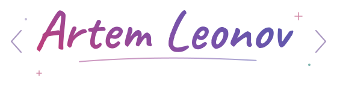
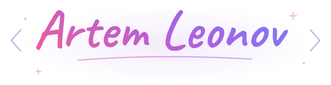

   
  

I'm Artem. I build Python backends and iOS apps, with projects in document AI, automation, and market research.

## Selected projects

  &nbsp;
  <strong><a href="https://github.com/artemleonich/docrag">DocRAG</a></strong> — local PDF answers with source citations and Word / PowerPoint drafts. <code>FastAPI</code>

  &nbsp;
  <strong><a href="https://github.com/artemleonich/Recorder">Recorder</a></strong> — iOS voice notes with on-device transcription and text search. <code>WhisperKit</code>

  &nbsp;
  <strong><a href="https://github.com/artemleonich/Parser-prices">PriceRadar</a></strong> — marketplace price monitoring, Telegram alerts and price history. <code>MVP</code>

  &nbsp;
  <strong><a href="https://github.com/artemleonich/Moex">MOEX</a></strong> — IslandForest, walk-forward evaluation and portfolio backtests. <code>Research</code>

### Tools in my projects

  &nbsp; &nbsp; &nbsp; &nbsp; &nbsp; &nbsp; &nbsp; 

More projects & learning

- **[Rate research](https://github.com/artemleonich/Moex-key-rate)** — CBR key-rate changes, Russian equities, and statistical experiments.
- **[Yatube](https://github.com/artemleonich/yatube_project)** — a Django learning project with posts, comments, and author follows.
- **[Homework Bot](https://github.com/artemleonich/homework_bot)** — Yandex Practicum review updates in Telegram.
- **iOS practice:** [MovieQuiz](https://github.com/artemleonich/MovieQuiz-ios) · [Counter](https://github.com/artemleonich/Counter).
- **Python practice:** [first exercise](https://github.com/artemleonich/backend_test_homework) · [fitness tracker / OOP](https://github.com/artemleonich/hw_python_oop).
- **Django learning path:** [communities](https://github.com/artemleonich/hw02_community) → [forms](https://github.com/artemleonich/hw03_forms) → [tests](https://github.com/artemleonich/hw04_tests) → [final project](https://github.com/artemleonich/hw05_final).
- **[Lux support](https://github.com/artemleonich/lux-support)** — public support and privacy documentation.

По-русски

Я Артём. Создаю бэкенд на Python и приложения для iOS; мои проекты посвящены работе с документами, автоматизации и исследованию рыночных данных.

- **[DocRAG](https://github.com/artemleonich/docrag)** — ответы по PDF с источниками и проекты документов Word / PowerPoint.
- **[Recorder](https://github.com/artemleonich/Recorder)** — голосовые заметки с локальной транскрипцией и поиском.
- **[PriceRadar](https://github.com/artemleonich/Parser-prices)** — MVP мониторинга цен с Telegram-уведомлениями.
- **[MOEX](https://github.com/artemleonich/Moex)** — исследование ансамблей и бэктесты на данных Московской биржи.

Учебные работы по Python, Django и Swift собраны в разделе выше.

---

[All repositories](https://github.com/artemleonich?tab=repositories) · [Support my work ☕](https://www.buymeacoffee.com/artemleonich)

